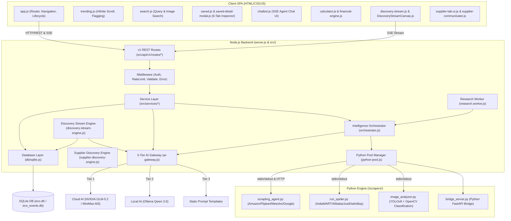
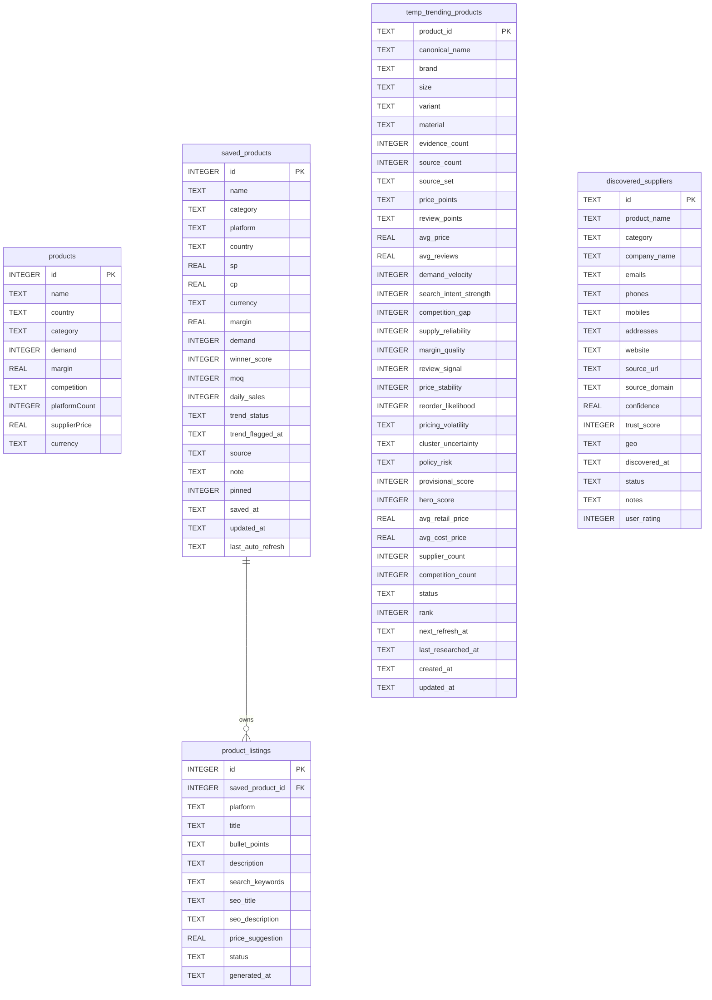

# ECO Command Center v2 - Complete Project Mapping & Architecture Blueprint

> [!IMPORTANT]
> ## 🚀 Quick Start & Installation Guide
> 
> Follow these instructions to fetch the project from Git, run the automated environment setup script, and start the project locally on your system.
> 
> ### Step 1: Fetch Project from Git
> Clone the repository and navigate into the project directory:
> ```powershell
> git clone <repository-url>
> cd eco
> ```
> 
> ### Step 2: Run Automated Environment Setup Script
> Execute the provided PowerShell setup script [setup_environment.ps1](file:///d:/eco/setup_environment.ps1) to automatically check existing applications, install missing system dependencies (Node.js >= v20, Python >= 3.10, Git, Ollama), install Python packages ([requirements.txt](file:///d:/eco/requirements.txt)), install Node packages (`package.json`), and configure `.env`:
> ```powershell
> Set-ExecutionPolicy -Scope Process -ExecutionPolicy Bypass
> .\setup_environment.ps1
> ```
> 
> ### Step 3: Run the Project Locally
> Once setup is complete, start the server locally:
> ```powershell
> # Optional: Start Ollama for local Qwen 3.6 AI fallback
> ollama serve
> 
> # Start ECO Command Center Backend Node.js server
> npm start
> ```
> Open your browser and navigate to **`http://localhost:3000`** (or configured `PORT`).

---

## 🎯 Primary Project Motive: Fully Automated Market Analyzer & Product Finder

The core objective of **ECO Command Center v2** is to operate as an end-to-end **Fully Automated Market Analyzer & Product Finder**. The system autonomously scans global and domestic e-commerce ecosystems (Amazon, Flipkart, Meesho, Google Shopping, Alibaba, IndiaMART), discovers trending and high-velocity product opportunities, evaluates market demand, calculates true landed financial margins, locates reliable manufacturers/suppliers, and generates actionable launch playbooks—all with zero manual friction.

---

## 🗺️ Architectural Topology & System Integration Flow

ECO Command Center is built as a modular **Node.js (ES Module) Monolithic Server** serving a **PWA Vanilla JavaScript Single-Page Application (SPA)**. It relies on a local **SQLite Database (`node:sqlite`)** operating in Write-Ahead Logging (WAL) mode, and spawns **Python child processes** (Scrapling, Scrapy, YOLOv8/OpenCV) for advanced web scraping and visual object classification.



---

## 📁 Exhaustive File-by-File Codebase Inventory

Every single file in the repository (`d:\eco`) is mapped and classified below by subsystem:

### 1. Root Directory
*   **[index.html](file:///d:/eco/index.html)**: Master SPA layout shell housing view containers for Dashboard, Trending, Search, Saved, Calculator, Discovery Stream, Suppliers, Settings, and Chatbot Panel.
*   **[server.js](file:///d:/eco/server.js)**: Core API server (~3,390 lines). Routes requests, manages memory rate limiting, hosts Server-Sent Events (SSE) for chat and discovery, handles file uploads, and spawns Python bridges.
*   **[scraper.js](file:///d:/eco/scraper.js)**: Crawlee bridge using `CheerioCrawler` to run light, parallel scraping against Amazon, Flipkart, Google Shopping, and eBay.
*   **[manual.html](file:///d:/eco/manual.html)**: Interactive offline user manual for platform operations.
*   **[manifest.json](file:///d:/eco/manifest.json)** / **[service-worker.js](file:///d:/eco/service-worker.js)**: PWA web application manifest and offline asset caching service worker.
*   **[eco.db](file:///d:/eco/eco.db)** / **[eco.db-shm](file:///d:/eco/eco.db-shm)** / **[eco.db-wal](file:///d:/eco/eco.db-wal)** / **[eco_events.db](file:///d:/eco/eco_events.db)**: SQLite databases configured in Write-Ahead Logging (WAL) mode for persistent storage and event tracking.
*   **[yolov8n.pt](file:///d:/eco/yolov8n.pt)**: Pre-trained YOLOv8 object detection weights for image analysis.
*   **[PROJECT_AUDIT_REPORT.md](file:///d:/eco/PROJECT_AUDIT_REPORT.md)** / **[audit_findings.md](file:///d:/eco/audit_findings.md)**: System audits, code health reports, and resolution logs.
*   **[README.md](file:///d:/eco/README.md)**: General project overview.
*   **[RAM READ THIS FIRST.md](file:///d:/eco/RAM%20READ%20THIS%20FIRST.md)**: Master technical blueprint and end-to-end architectural process flow guide.
*   **[.env](file:///d:/eco/.env)** / **[.env.example](file:///d:/eco/.env.example)**: Environment variable definitions (API keys, ports, model endpoints).
*   **[setup_environment.ps1](file:///d:/eco/setup_environment.ps1)**: Automated PowerShell environment verification & dependency installation script.
*   **[requirements.txt](file:///d:/eco/requirements.txt)**: Python package manifest listing required web scraping, vision, and API libraries.
*   **[docker-compose.yml](file:///d:/eco/docker-compose.yml)**: Docker orchestration file for containerized execution.
*   **[package.json](file:///d:/eco/package.json)** / **[package-lock.json](file:///d:/eco/package-lock.json)**: Node.js dependency definitions and build scripts.
*   **[.gitignore](file:///d:/eco/.gitignore)**: Version control exclusion rules.

---

### 2. Python Scraper & Vision Engines (`/scrapers/`)
*   **[scrapers/scrapling_agent.py](file:///d:/eco/scrapers/scrapling_agent.py)**: Stealth scraper utilizing the `scrapling` Python library to bypass bot detection on Amazon, Flipkart, Meesho, and Google Shopping.
*   **[scrapers/run_spider.py](file:///d:/eco/scrapers/run_spider.py)**: Inline Scrapy crawler manager for B2B supplier extraction (IndiaMART, Alibaba, JustDial, eBay India).
*   **[scrapers/image_analyzer.py](file:///d:/eco/scrapers/image_analyzer.py)**: Vision classifier using OpenCV (HSV color histograms & Laplacian edge texture complexity) and YOLOv8 for item detection.
*   **[scrapers/bridge_server.py](file:///d:/eco/scrapers/bridge_server.py)**: Lightweight Python FastAPI HTTP bridge for persistent scraper worker communication.
*   **[scrapers/scrapy_spiders/](file:///d:/eco/scrapers/scrapy_spiders/)**: Directory for modular Scrapy spider plugins.

---

### 3. Backend Core & Infrastructure (`/src/`)
*   **[src/config.js](file:///d:/eco/src/config.js)**: Central configuration store for ports, rate limits, timeouts, and AI providers.
*   **[src/cache.js](file:///d:/eco/src/cache.js)**: In-memory LRU cache manager with TTLs to eliminate redundant API and scraping queries.
*   **[src/compression.js](file:///d:/eco/src/compression.js)**: Native GZIP HTTP response compression helper.
*   **[src/dedup.js](file:///d:/eco/src/dedup.js)**: In-flight request deduplication layer preventing concurrent identical API requests.
*   **[src/validators.js](file:///d:/eco/src/validators.js)**: Input validation framework (URL syntax, product names, ISO codes, API keys).
*   **[src/logger.js](file:///d:/eco/src/logger.js)**: Colored console logger with in-memory log buffering for telemetry endpoints.
*   **[src/metrics.js](file:///d:/eco/src/metrics.js)**: Endpoint latency, error rate, and P95 performance metrics accumulator.
*   **[src/health.js](file:///d:/eco/src/health.js)**: Health checker for RSS memory, SQLite DB responsiveness, and disk availability.
*   **[src/qwen-prompts.js](file:///d:/eco/src/qwen-prompts.js)**: Structured prompt templates for local Ollama Qwen model execution.
*   **[src/discovery-stream-engine.js](file:///d:/eco/src/discovery-stream-engine.js)**: Core SSE continuous market discovery engine coordinating geographic category scouting and product mining.
*   **[src/hero-research-orchestrator.js](file:///d:/eco/src/hero-research-orchestrator.js)**: Multi-phase product candidate scouting, clustering, and deep research orchestrator.
*   **[src/supplier-discovery-engine.js](file:///d:/eco/src/supplier-discovery-engine.js)**: Self-improving supplier sourcing engine operating on Epsilon-Greedy selection paths.

#### API Layer (`/src/api/v1/`)
*   **Routes (`/src/api/v1/routes/`)**:
    *   `calculator.routes.js`: Financial calculation routes.
    *   `chatbot.routes.js`: SSE streaming chat and AI agent routes.
    *   `discovery.routes.js`: Live discovery stream control routes.
    *   `health.routes.js`: System health endpoint.
    *   `metrics.routes.js`: Operational performance metrics.
    *   `products.routes.js`: Catalog product management.
    *   `research.routes.js`: Deep research triggers and status checks.
    *   `saved.routes.js`: Bookmarked product management and 6-tab modal detailed data.
    *   `search.routes.js`: Search engine and image upload endpoints.
    *   `suppliers.routes.js`: Discovered and saved supplier directory routes.
*   **Middleware (`/src/api/v1/middleware/`)**:
    *   `auth.middleware.js`: API token verification middleware.
    *   `error.middleware.js`: Centralized error handler and response standardizer.
    *   `rate-limit.middleware.js`: In-memory rate limiting middleware.
    *   `validate.middleware.js`: Schema-based request payload validator.
*   **Schemas (`/src/api/v1/schemas/`)**:
    *   `product.schema.js`: Product model validation schemas.
    *   `research.schema.js`: Research task validation schemas.
    *   `search.schema.js`: Search query validation schemas.

#### Infrastructure Services (`/src/infrastructure/`)
*   **[src/infrastructure/cold-storage.js](file:///d:/eco/src/infrastructure/cold-storage.js)**: Long-term file archive manager for raw research artifacts.
*   **[src/infrastructure/event-store.js](file:///d:/eco/src/infrastructure/event-store.js)**: Event sourcing store tracking system events in `eco_events.db`.
*   **[src/infrastructure/logger.js](file:///d:/eco/src/infrastructure/logger.js)**: Low-level infrastructure logging wrapper.
*   **[src/infrastructure/python-pool.js](file:///d:/eco/src/infrastructure/python-pool.js)**: Process pool manager for executing Python scrapers cleanly.
*   **[src/infrastructure/queue.js](file:///d:/eco/src/infrastructure/queue.js)**: In-memory background queue engine.
*   **[src/infrastructure/semantic-search.js](file:///d:/eco/src/infrastructure/semantic-search.js)**: Semantic text similarity matcher.

#### Intelligence & Agents (`/src/intelligence-layer/`)
*   **[src/intelligence-layer/ai-gateway.js](file:///d:/eco/src/intelligence-layer/ai-gateway.js)**: 3-tier fallback AI gateway (Cloud -> Local Qwen -> Offline Prompts) with circuit breaking.
*   **[src/intelligence-layer/orchestrator.js](file:///d:/eco/src/intelligence-layer/orchestrator.js)**: 5-phase research pipeline coordinator.
*   **[src/intelligence-layer/signal-detector.js](file:///d:/eco/src/intelligence-layer/signal-detector.js)**: Phase 1 trend signal & keyword detector.
*   **[src/intelligence-layer/market-validator.js](file:///d:/eco/src/intelligence-layer/market-validator.js)**: Phase 2 TAM/SAM/SOM market & entry barrier validator.
*   **[src/intelligence-layer/supplier-archaeologist.js](file:///d:/eco/src/intelligence-layer/supplier-archaeologist.js)**: Phase 3 domestic & global B2B supplier archaeologist.
*   **[src/intelligence-layer/financial-modeler.js](file:///d:/eco/src/intelligence-layer/financial-modeler.js)**: Phase 4 unit economics & landed margin financial modeler.
*   **[src/intelligence-layer/execution-planner.js](file:///d:/eco/src/intelligence-layer/execution-planner.js)**: Phase 5 launch playbook & channel execution planner.
*   **[src/intelligence-layer/india-stack.js](file:///d:/eco/src/intelligence-layer/india-stack.js)**: GST verification & localized Hinglish WhatsApp RFQ builder.
*   **[src/intelligence-layer/inference-engine.js](file:///d:/eco/src/intelligence-layer/inference-engine.js)**: Daily/monthly sales volume estimation heuristics.
*   **[src/intelligence-layer/competitive-graph.js](file:///d:/eco/src/intelligence-layer/competitive-graph.js)**: Competitor landscape and price distribution graphing engine.
*   **[src/intelligence-layer/forecasting-engine.js](file:///d:/eco/src/intelligence-layer/forecasting-engine.js)**: Time-series demand and sales velocity forecaster.
*   **[src/intelligence-layer/research-worker.js](file:///d:/eco/src/intelligence-layer/research-worker.js)**: Deep research task execution handler.
*   **Agents (`/src/intelligence-layer/agents/`)**:
    *   `base-agent.js`: Base class for autonomous intelligence agents.
    *   `critic.agent.js`: AI Critic agent performing adversarial checks on product viability scores.
    *   `signal-scout.agent.js`: Autonomous signal scouting agent monitoring keyword velocity.

#### Service Layer (`/src/services/`)
*   `calculator.service.js`, `chatbot.service.js`, `discovery.service.js`, `health.service.js`, `metrics.service.js`, `product.service.js`, `research.service.js`, `saved.service.js`, `search.service.js`, `supplier.service.js`: Domain-specific business logic services insulating routes from database and engine internals.

#### Background Workers (`/src/workers/`)
*   **[src/workers/research.worker.js](file:///d:/eco/src/workers/research.worker.js)**: Async worker loop processing queued deep research jobs.

---

### 4. Database Access Layer (`/db/` & `/scripts/`)
*   **[db/sqlite.js](file:///d:/eco/db/sqlite.js)**: Native `node:sqlite` database interface. Defines tables, manages migrations, creates indexes, and executes queries.
*   **[db/schema.sql](file:///d:/eco/db/schema.sql)**: Reference SQL schema for supplier discovery tables.
*   **[db/schema_v3.sql](file:///d:/eco/db/schema_v3.sql)**: Incremental V3 schema migration definitions.
*   **[scripts/migrate.js](file:///d:/eco/scripts/migrate.js)**: Database migration CLI script.

---

### 5. Frontend Client Assets (`/src/js/`, `/css/`)
*   **[src/js/app.js](file:///d:/eco/src/js/app.js)**: Main client bootstrap, SPA view switcher, tab router, and settings manager.
*   **[src/js/trending.js](file:///d:/eco/src/js/trending.js)**: Trending products table renderer with infinite scroll and threshold filtering.
*   **[src/js/search.js](file:///d:/eco/src/js/search.js)**: Multi-platform search controller and visual image upload search handler.
*   **[src/js/saved.js](file:///d:/eco/src/js/saved.js)**: Bookmarked products grid view, filters, and note editor.
*   **[src/js/saved-detail-modal.js](file:///d:/eco/src/js/saved-detail-modal.js)**: 6-tab modal detail inspector (Overview, Financials, Ops, Marketing, Supplier, Export).
*   **[src/js/dashboard.js](file:///d:/eco/src/js/dashboard.js)**: Analytics dashboard with KPI summaries, sales forecasts, and category distribution charts.
*   **[src/js/calculator.js](file:///d:/eco/src/js/calculator.js)**: True landed cost calculator UI event handler.
*   **[src/js/suppliers.js](file:///d:/eco/src/js/suppliers.js)**: Discovered and saved supplier directory UI.
*   **[src/js/supplier-tab-ui.js](file:///d:/eco/src/js/supplier-tab-ui.js)**: Supplier search and interaction controller.
*   **[src/js/supplier-communicator.js](file:///d:/eco/src/js/supplier-communicator.js)**: Generator for supplier RFQs, emails, and Hinglish WhatsApp templates.
*   **[src/js/chatbot.js](file:///d:/eco/src/js/chatbot.js)**: SSE AI chatbot interface rendering streaming responses and tool execution callouts.
*   **[src/js/ai-coach.js](file:///d:/eco/src/js/ai-coach.js)**: Context-aware banner offering proactive business tips per tab.
*   **[src/js/competitor-tracker.js](file:///d:/eco/src/js/competitor-tracker.js)**: Competitor price tracking chart rendering.
*   **[src/js/currency.js](file:///d:/eco/src/js/currency.js)**: Dynamic multi-currency FX converter.
*   **[src/js/export-engine.js](file:///d:/eco/src/js/export-engine.js)**: Client-side report export engine (CSV, JSON, PDF).
*   **[src/js/financial-engine.js](file:///d:/eco/src/js/financial-engine.js)**: Financial formulas and margin calculations.
*   **[src/js/tax-engine.js](file:///d:/eco/src/js/tax-engine.js)**: Multi-region tax calculator (India GST, US Sales Tax, EU VAT).
*   **[src/js/discovery-stream.js](file:///d:/eco/src/js/discovery-stream.js)**: Real-time discovery stream UI manager tracking save/skip rates.
*   **[src/js/db.js](file:///d:/eco/src/js/db.js)**: Client REST API wrapper mapping local UI operations to backend endpoints.
*   **[src/js/data-seed.js](file:///d:/eco/src/js/data-seed.js)**: Initial offline sample data seed provider.
*   **[src/js/ai-engine.js](file:///d:/eco/src/js/ai-engine.js)** / **[src/js/agent-engine.js](file:///d:/eco/src/js/agent-engine.js)** / **[src/js/research-engine.js](file:///d:/eco/src/js/research-engine.js)**: Client wrappers managing AI agent prompts, contexts, and research runs.
*   **[src/js/ui-utils.js](file:///d:/eco/src/js/ui-utils.js)**: UI helper utilities (shimmer skeletons, toast alerts, modal triggers).
*   **Components (`/src/js/components/`)**:
    *   `DiscoveryStreamCanvas.js`: Canvas visual card renderer for real-time product discovery.
    *   `ResearchPipeline.vue`: Component visualizing deep research stage progression.
*   **Stores (`/src/js/stores/`)**:
    *   `research.store.js`: Reactive state store for active background research tasks.
*   **Stylesheets (`/css/`)**:
    *   `css/styles.css`: Core design system (dark mode, glassmorphism, responsive grids).
    *   `css/supplier.css`: Custom layout styles for sourcing and supplier outreach UI.

---

### 6. Storage & Upload Directories (`/storage/`, `/uploads/`)
*   **[storage/key_value_stores/](file:///d:/eco/storage/key_value_stores/)**: Storage location for Crawlee key-value persistence.
*   **[storage/request_queues/](file:///d:/eco/storage/request_queues/)**: Storage location for Crawlee request queue state.
*   **[uploads/](file:///d:/eco/uploads/)**: Temporary destination for uploaded search images.

---

## ⚡ Complete End-to-End System Process Flows

### Flow 1: Automated Continuous Discovery Stream Process Flow

```
┌───────────────────────────────┐
│ Discovery Stream Engine Start │
└──────────────┬────────────────┘
               │
               ▼
┌───────────────────────────────┐
│ Select Scout Region & Category│◄─── Reads Category Heatmap & Site Intelligence
└──────────────┬────────────────┘
               │
               ▼
┌───────────────────────────────┐
│ Generate Target Search Queries│◄─── AI Prompt / Query Templates Engine
└──────────────┬────────────────┘
               │
               ▼
┌───────────────────────────────┐
│ Spawn Python Scrapling Agent  │─── Scrapes Amazon, Flipkart, Meesho, Google Shopping
└──────────────┬────────────────┘
               │
               ▼
┌───────────────────────────────┐
│ Deduplicate & Score Candidates│◄─── Signal Detector & Heuristic Score
└──────────────┬────────────────┘
               │
               ▼
┌───────────────────────────────┐
│ Stream Product via SSE to SPA │─── Rendered on Discovery Stream Canvas in real-time
└──────────────┬────────────────┘
               │
               ▼
┌───────────────────────────────┐
│ User Swipes / Saves / Skips   │─── Updates Category Heatmap & Site Intelligence Weights
└───────────────────────────────┘
```

---

### Flow 2: 5-Phase Deep Research & Product Finder Pipeline

```
  [User Triggers Deep Research / High-Score Candidate Flagged]
                             │
                             ▼
 ┌────────────────────────────────────────────────────────┐
 │ PHASE 1: Signal Detection (signal-detector.js)         │
 │ • Extracts search velocity, review growth & demand    │
 └───────────────────────────┬────────────────────────────┘
                             │
                             ▼
 ┌────────────────────────────────────────────────────────┐
 │ PHASE 2: Market Validation (market-validator.js)       │
 │ • Calculates TAM, SAM, SOM estimates & entry barriers  │
 └───────────────────────────┬────────────────────────────┘
                             │
                             ▼
 ┌────────────────────────────────────────────────────────┐
 │ PHASE 3: Supplier Archaeology (supplier-archaeologist) │
 │ • Spawns Scrapy spiders against IndiaMART & Alibaba     │
 │ • Extracts manufacturer contacts, emails & WhatsApps   │
 └───────────────────────────┬────────────────────────────┘
                             │
                             ▼
 ┌────────────────────────────────────────────────────────┐
 │ PHASE 4: Financial Modeling (financial-modeler.js)     │
 │ • Calculates landed cost, tariffs, shipping & ROI      │
 └───────────────────────────┬────────────────────────────┘
                             │
                             ▼
 ┌────────────────────────────────────────────────────────┐
 │ PHASE 5: Execution Planning (execution-planner.js)     │
 │ • Generates launch playbooks & Hinglish WhatsApp RFQs  │
 └───────────────────────────┬────────────────────────────┘
                             │
                             ▼
 ┌────────────────────────────────────────────────────────┐
 │ ADVERSARIAL REVIEW: AI Critic Agent (critic.agent.js)   │
 │ • Evaluates risk factors, penalizes low margins        │
 └───────────────────────────┬────────────────────────────┘
                             │
                             ▼
 ┌────────────────────────────────────────────────────────┐
 │ PERSISTENCE: Save to SQLite (`temp_trending_products`) │
 └────────────────────────────────────────────────────────┘
```

---

### Flow 3: Resilient 3-Tier AI Fallback & Circuit Breaker Flow

```
                    [AI Gateway Call (`callAI`)]
                                │
                                ▼
                      { Circuit Breaker Open? }
                       /                     \
                   (Yes)                     (No)
                    /                         \
                   ▼                           ▼
        ┌──────────────────┐         { Check Connectivity }
        │ Force Offline    │         /          |          \
        │ Static Template  │        /           |           \
        └──────────────────┘       ▼            ▼            ▼
                             ┌──────────┐ ┌──────────┐ ┌──────────┐
                             │ Tier 1:  │ │ Tier 2:  │ │ Tier 3:  │
                             │ Cloud AI │ │ Local Qwen│ │ Offline  │
                             │ (GLM/MM) │ │ (Ollama) │ │ Template │
                             └────┬─────┘ └────┬─────┘ └────┬─────┘
                                  │            │            │
                                  ▼            ▼            ▼
                             { Success? } { Success? } { Success? }
                              /        \   /        \   /        \
                            (Yes)      (No)(Yes)    (No)(Yes)    (No)
                            /            \ /          \ /          \
                           ▼              ▼            ▼            ▼
                      [Return OK]     [Trip Error] [Return OK] [Fallback]
```

---

## 🗄️ Database Entity-Relationship & Schema Topology



---

## 📊 Complete SQLite Database Table Directory

| Table Name | Defined In | Function |
| :--- | :--- | :--- |
| `products` | `db/sqlite.js` | Baseline products for offline mode. |
| `suppliers` | `db/sqlite.js` | Master directory of default suppliers and contacts. |
| `platforms` | `db/sqlite.js` | E-commerce commission fee reference table per region. |
| `saved_products` | `db/sqlite.js` | User bookmarks with pricing overrides and 6-tab audit data. |
| `settings` | `db/sqlite.js` | System key-value configurations and active AI keys. |
| `exchange_rates` | `db/sqlite.js` | Cached foreign exchange rates for dynamic currency conversions. |
| `product_details` | `db/sqlite.js` | Cached deep research outputs per product. |
| `product_listings` | `db/sqlite.js` | Generated listing titles, descriptions, and SEO keywords. |
| `scrape_cache` | `db/sqlite.js` | Prevents redundant scraping runs for duplicate queries. |
| `url_lookups` | `db/sqlite.js` | Reverse query cache matching URLs to product data. |
| `search_history` | `db/sqlite.js` | User search query audit trail. |
| `research_runs` | `db/sqlite.js` | Deep research execution run tracker. |
| `research_candidates` | `db/sqlite.js` | Raw scraped product candidates undergoing evaluation. |
| `temp_trending_products` | `db/sqlite.js` | Clustered and scored trending products workspace. |
| `discovery_sessions` | `db/sqlite.js` | SSE discovery stream telemetry and session data. |
| `category_heatmap` | `db/sqlite.js` | Category weightings based on user save/skip interactions. |
| `site_intelligence` | `db/sqlite.js` | Scraping success rate and margin stats per site/category. |
| `stream_products` | `db/sqlite.js` | Live products stream cache. |
| `query_templates` | `db/sqlite.js` | High-performing query template repository. |
| `research_queue` | `db/sqlite.js` | Background research worker task queue. |
| `research_failures` | `db/sqlite.js` | Diagnostic error logs for failed research tasks. |
| `supplier_auto_discovered` | `db/sqlite.js` | Sourced supplier contacts pending verification. |
| `discovered_suppliers` | `db/schema.sql` | Fully parsed and verified supplier profiles. |
| `supplier_sources` | `db/schema.sql` | Performance statistics for B2B supplier domains. |
| `keyword_feedback` | `db/schema.sql` | Reinforcement feedback on search keyword quality. |
| `keyword_templates` | `db/schema.sql` | Keyword template library for supplier hunting. |

---

## 📈 Health, Telemetry & Operations

ECO Command Center includes live self-diagnostic endpoints served under `/api/`:
1.  **`/api/health`**: Audits system RSS RAM consumption, SQLite WAL response time, and filesystem health.
2.  **`/api/logs`**: Streams formatted log buffer entries.
3.  **`/api/metrics`**: Calculates request counters, fail rates, and P95 response latency.
4.  **`/api/cache/stats`**: Reports LRU cache hit ratio, capacity, and current memory footprint.
