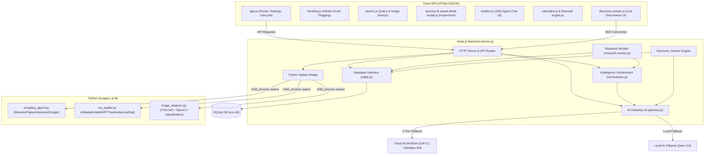
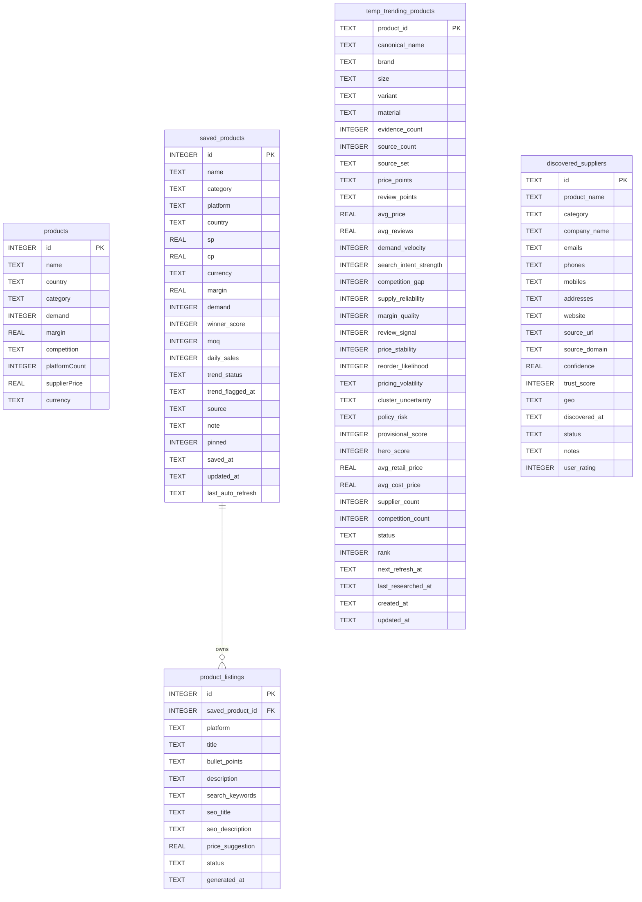

# ECO Command Center v2 - Complete Project Mapping & Architecture Blueprint

This document provides a highly detailed mapping of the **ECO Command Center v2 (Solo Edition)** codebase located at `d:\eco`. It traces the project's folder structure, component architecture, database schemas, AI fallbacks, data flow pipelines, scraping engines, and frontend architecture.

---

## 🗺️ Architectural Topology

The application is structured as a **monolithic Node.js (ES Module) backend** serving a **PWA vanilla JavaScript Single Page Application (SPA)**. It relies on a local **SQLite database (`node:sqlite`)** and spawns **Python child processes** for advanced scraping and machine learning (YOLOv8) tasks.



---

## 📁 Complete Directory & File Blueprint

### 1. Root Directory

*   **[index.html](file:///d:/eco/index.html)**: The master SPA layout shell. Houses all views (Dashboard, Trending, Search, Saved, Calculator, Discovery Stream, Settings, Chatbot Panel). Uses custom data attributes (`data-target`) for SPA tab navigation.
*   **[server.js](file:///d:/eco/server.js)**: The core API server (~3,390 lines). Routes requests, handles memory rate limiting, hosts the Server-Sent Events (SSE) channel for chatbot and discovery, manages Python bridge subprocess spawning, and implements route-level API proxies.
*   **[scraper.js](file:///d:/eco/scraper.js)**: Crawlee bridge logic. Invokes `CheerioCrawler` to run light, parallel, credential-free web scraping against Amazon, Flipkart, Google Shopping, and eBay. Uses random User-Agents for bot evasion.
*   **[manual.html](file:///d:/eco/manual.html)**: Interactive, beautifully formatted offline manual.
*   **[manifest.json](file:///d:/eco/manifest.json)** / **[service-worker.js](file:///d:/eco/service-worker.js)**: Configures the PWA profile, enabling offline availability, image/asset caching, and browser installation prompts.
*   **[eco.db](file:///d:/eco/eco.db)** / **eco.db-shm** / **eco.db-wal**: The local SQLite database files (configured in Write-Ahead Logging mode).
*   **[yolov8n.pt](file:///d:/eco/yolov8n.pt)**: Pre-trained weights for YOLOv8 Object Detection.
*   **[PROJECT_AUDIT_REPORT.md](file:///d:/eco/PROJECT_AUDIT_REPORT.md)** / **[audit_findings.md](file:///d:/eco/audit_findings.md)**: Architectural audits and bug tracking history.

### 2. Sourcing & Scraping Modules (`/scrapers/`)

*   **[scrapers/scrapling_agent.py](file:///d:/eco/scrapers/scrapling_agent.py)**: Python bridge script utilizing the `scrapling` library. Scrapes Amazon, Flipkart, Meesho, and Google Shopping. Parses raw CSS selectors for prices, names, ratings, and reviews, exporting structured JSON to stdout.
*   **[scrapers/run_spider.py](file:///d:/eco/scrapers/run_spider.py)**: Spawns Scrapy crawlers inline for B2B/business discovery:
    *   `indiamart`: extracts product title, supplier, address, MOQ, and contact info.
    *   `alibaba`: extracts verified status, supplier country, tiered MOQ, and pictures.
    *   `justdial`: local directory parsing for contact phone numbers and local categories.
    *   `ebay_india`: parses secondary item properties and pricing arrays.
*   **[scrapers/image_analyzer.py](file:///d:/eco/scrapers/image_analyzer.py)**: Visual classification model. Uses OpenCV to compute dominant HSV color values and Laplacian edge density (categorizes item as "solid", "patterned", or "textured"). Feeds the image to YOLOv8 for item mapping (e.g. mapping "cell phone" to "smartphone" for purchase optimization).

### 3. Core Backend Components (`/src/`)

*   **[src/config.js](file:///d:/eco/src/config.js)**: Unified environment and configuration storage. Stores default model options, timeouts, ports, and rate limits.
*   **[src/cache.js](file:///d:/eco/src/cache.js)**: In-memory LRU caching class with dynamic TTls. Prevents redundant product search queries.
*   **[src/compression.js](file:///d:/eco/src/compression.js)**: Streamlined GZIP compression helpers for Express-like native HTTP responses.
*   **[src/dedup.js](file:///d:/eco/src/dedup.js)**: Prevents overlapping parallel executions of the exact same API requests.
*   **[src/validators.js](file:///d:/eco/src/validators.js)**: Input validation framework (handles regex for product names, URLs, API keys, and ISO country matches).
*   **[src/logger.js](file:///d:/eco/src/logger.js)**: Implements colored, component-tagged terminal logger with memory buffer export.
*   **[src/metrics.js](file:///d:/eco/src/metrics.js)**: Gathers response times, endpoint request counters, and error rates to output P95 statistics.
*   **[src/health.js](file:///d:/eco/src/health.js)**: Evaluates RSS memory consumption, SQLite responsiveness, and file system states.
*   **[src/qwen-prompts.js](file:///d:/eco/src/qwen-prompts.js)**: Prompt template library for Ollama local Qwen 3.6 execution. Features optimized templates for product detail extraction, marketplace listing, trending signals, and supplier communications.
*   **[src/hero-research-orchestrator.js](file:///d:/eco/src/hero-research-orchestrator.js)**: Coordinates multi-phase research runs. Scrapes candidates, performs clustering, scores provisional values, performs deep retail/sourcing analysis, adjusts ratings via a MiniMax critic loop, and saves results.
*   **[src/discovery-stream-engine.js](file:///d:/eco/src/discovery-stream-engine.js)**: Directs the real-time endless SSE discovery pipeline. Coordinates geographic configuration, category scouting, site selection, query generation, and mining.
*   **[src/supplier-discovery-engine.js](file:///d:/eco/src/supplier-discovery-engine.js)**: Drives self-improving supplier hunting. Evaluates sources via Epsilon-Greedy paths, constructs search queries via LLM, crawls B2B listings via Crawlee, and scores confidence.

#### Intelligence Layer (`/src/intelligence-layer/`)

*   **[src/intelligence-layer/ai-gateway.js](file:///d:/eco/src/intelligence-layer/ai-gateway.js)**: Orchestrates the 3-tier fallback chain. Includes health pings, a circuit breaker (trips on 5 cloud errors for 60s), and Qwen prompt compression.
*   **[src/intelligence-layer/orchestrator.js](file:///d:/eco/src/intelligence-layer/orchestrator.js)**: Connects the 5-phase product auditing pipeline.
*   **[src/intelligence-layer/signal-detector.js](file:///d:/eco/src/intelligence-layer/signal-detector.js)**: Gathers trends and keyword velocity (Phase 1).
*   **[src/intelligence-layer/market-validator.js](file:///d:/eco/src/intelligence-layer/market-validator.js)**: Generates TAM, SAM, SOM estimates and barriers to entry (Phase 2).
*   **[src/intelligence-layer/supplier-archaeologist.js](file:///d:/eco/src/intelligence-layer/supplier-archaeologist.js)**: Locates domestic industrial sourcing hubs or global options (Phase 3).
*   **[src/intelligence-layer/india-stack.js](file:///d:/eco/src/intelligence-layer/india-stack.js)**: Handles GST traceability and custom Hinglish WhatsApp template builders.
*   **[src/intelligence-layer/financial-modeler.js](file:///d:/eco/src/intelligence-layer/financial-modeler.js)**: Simulates landed unit cost, break-even targets, and ROI (Phase 4).
*   **[src/intelligence-layer/execution-planner.js](file:///d:/eco/src/intelligence-layer/execution-planner.js)**: Formulates timeline playbooks and channel recommendations (Phase 5).
*   **[src/intelligence-layer/inference-engine.js](file:///d:/eco/src/intelligence-layer/inference-engine.js)**: Translates rating frequency and review ages into daily/monthly sales volume estimates.
*   **[src/intelligence-layer/research-worker.js](file:///d:/eco/src/intelligence-layer/research-worker.js)**: Manages background queue operations.

### 4. Database Access Layer (`/db/`)

*   **[db/sqlite.js](file:///d:/eco/db/sqlite.js)**: The database layer using Node's native `node:sqlite` API. Defines tables, configures index properties, handles automatic data migration from older local DB structures, and exposes raw CRUD operations.
*   **[db/schema.sql](file:///d:/eco/db/schema.sql)**: Reference schema document for the supplier discovery tables.

### 5. Frontend Client Assets (`/js/` & `/css/`)

*   **[js/app.js](file:///d:/eco/js/app.js)**: Main client bootstrap. Handles view swapping, navigation, settings sync, and server lifecycle toggles.
*   **[js/trending.js](file:///d:/eco/js/trending.js)**: Renders trending product tables, manages infinite scroll thresholds, and caches database matches.
*   **[js/search.js](file:///d:/eco/js/search.js)**: Coordinates multi-engine queries, image upload pipelines, and URL lookup displays.
*   **[js/saved.js](file:///d:/eco/js/saved.js)**: Renders, filters, and deletes items from the SQLite database.
*   **[js/saved-detail-modal.js](file:///d:/eco/js/saved-detail-modal.js)**: Renders the 6-tab modal (Overview, Financials, Ops, Marketing, Supplier, Export) for saved products.
*   **[js/dashboard.js](file:///d:/eco/js/dashboard.js)**: Aggregates saved totals and displays financial forecasts and category graphs.
*   **[js/calculator.js](file:///d:/eco/js/calculator.js)**: Drives the client-side true cost calculator.
*   **[js/suppliers.js](file:///d:/eco/js/suppliers.js)**: Displays discovered supplier details and ratings.
*   **[js/chatbot.js](file:///d:/eco/js/chatbot.js)**: Displays chat streams and parses tool call event results.
*   **[js/ai-coach.js](file:///d:/eco/js/ai-coach.js)**: Supplies contextual alerts based on active tabs.
*   **[js/competitor-tracker.js](file:///d:/eco/js/competitor-tracker.js)**: Displays price monitoring charts.
*   **[js/currency.js](file:///d:/eco/js/currency.js)**: Runs exchange rate conversion and formatting.
*   **[js/export-engine.js](file:///d:/eco/js/export-engine.js)**: Generates CSV, JSON, and PDF reports.
*   **[js/financial-engine.js](file:///d:/eco/js/financial-engine.js)**: Client-side calculator calculations.
*   **[js/tax-engine.js](file:///d:/eco/js/tax-engine.js)**: Tax calculations for GST, VAT, and US Sales Tax.
*   **[js/ui-utils.js](file:///d:/eco/js/ui-utils.js)**: UI helper utilities (shimmer states, inputs, toasts).
*   **[js/discovery-stream.js](file:///d:/eco/js/discovery-stream.js)**: Renders discovery stream cards, counts save/skip rates, and manages active stream categories.
*   **[js/data-seed.js](file:///d:/eco/js/data-seed.js)**: Seeds default records if the database is empty.
*   **[js/db.js](file:///d:/eco/js/db.js)**: Proxy mapping to REST endpoints, maintaining legacy Dexie.js compatibility.
*   **[js/ai-engine.js](file:///d:/eco/js/ai-engine.js)** / **[js/agent-engine.js](file:///d:/eco/js/agent-engine.js)** / **[js/research-engine.js](file:///d:/eco/js/research-engine.js)**: Client wrappers that manage agent configurations, historical contexts, and research queries.
*   **[css/styles.css](file:///d:/eco/css/styles.css)**: Core design system. Dark-mode theme, glassmorphism, fonts, and responsive grid configurations.
*   **[css/supplier.css](file:///d:/eco/css/supplier.css)**: Sourcing layout styles.

---

## 🗄️ Database Schema Mapping



### Table Inventory & Target Use

| Table Name | File Source | Primary Function |
| :--- | :--- | :--- |
| `products` | `sqlite.js` | Seeded dummy listings for initial display offline. |
| `suppliers` | `sqlite.js` | Seeded supplier list used to show contact options in suppliers tab. |
| `platforms` | `sqlite.js` | E-commerce commission fee reference table (India, USA, UK, Germany, AU). |
| `saved_products` | `sqlite.js` | Central storage of user bookmarks, including price settings and notes. |
| `settings` | `sqlite.js` | Persistent key-value settings (API keys, active configuration). |
| `exchange_rates` | `sqlite.js` | Local cache for foreign currency conversion. |
| `product_details` | `sqlite.js` | Persistent cache for AI deep research outputs. |
| `product_listings` | `sqlite.js` | Stores AI generated product details and descriptions. |
| `scrape_cache` | `sqlite.js` | Prevents redundant scraping runs for similar query-country combinations. |
| `url_lookups` | `sqlite.js` | Reverse-lookup query cache matching specific URLs to product data. |
| `search_history` | `sqlite.js` | History log of user searches. |
| `research_runs` | `sqlite.js` | Stores background orchestrator runs. |
| `research_candidates` | `sqlite.js` | Tracks raw product matches discovered before final deduplication. |
| `temp_trending_products` | `sqlite.js` | Temporary workspace holding clustered items waiting for rating. |
| `discovery_sessions` | `sqlite.js` | Tracks telemetry for active SSE sessions. |
| `category_heatmap` | `sqlite.js` | Dynamic category ranking table based on save/skip rates. |
| `site_intelligence` | `sqlite.js` | Tracks success rate and margins per platform-category. |
| `stream_products` | `sqlite.js` | Stores products found during active SSE streams. |
| `query_templates` | `sqlite.js` | Saved query performance tracker used to guide AI search queries. |
| `research_queue` | `sqlite.js` | Research worker topic pipeline. |
| `research_failures` | `sqlite.js` | Diagnostic failure logs for research tasks. |
| `supplier_auto_discovered` | `sqlite.js` | Sourced contacts waiting for review. |
| `discovered_suppliers` | `schema.sql` | Discovered supplier details (company, phones, confidence). |
| `supplier_sources` | `schema.sql` | Sourcing domain success statistics. |
| `keyword_feedback` | `schema.sql` | Evaluates whether AI-generated search terms were useful. |
| `keyword_templates` | `schema.sql` | Sourcing keywords template library. |

---

## 🤖 AI Fallback Architecture (3-Tier)

When backend components invoke `callAI()`, the gateway manages connections across three tiers to guarantee offline and online resiliency:

```
           [Unified Gateway Trigger]
                       │
                       ▼
             { Is Circuit Open? }
              /               \
          (Yes)               (No)
            /                   \
           ▼                     ▼
┌──────────────────────┐  ┌─────────────────────────────────┐
│  Forced Fallback     │  │ Check provider connectivity     │
│  (Static Templates)  │  │ (Heartbeat status checks)       │
└──────────────────────┘  └────────────────┬────────────────┘
                                           │
                                           ▼
                                 { Select Active Tier }
                                  /        |         \
                                 /         |          \
                                ▼          ▼           ▼
                         ┌──────────┐ ┌──────────┐ ┌──────────────┐
                         │ Tier 1:  │ │ Tier 2:  │ │ Tier 3:      │
                         │ GLM-5.2  │ │ MiniMax  │ │ Local Qwen  │
                         └────┬─────┘ └────┬─────┘ └──────┬───────┘
                              │            │              │
                              ▼            ▼              ▼
                         { Succeed? } { Succeed? }   { Succeed? }
                          /        \   /        \     /        \
                        (Yes)      (No)        (No) (Yes)      (No)
                        /            \          /     /          \
                       ▼              ▼        ▼     ▼            ▼
                 [200 OK Response]  ┌────────────┐ [200 OK] ┌───────────┐
                                    │ Record     │          │ Offline   │
                                    │ Failure &  │          │ Template  │
                                    │ Failover   │          │ Fallback  │
                                    └────────────┘          └───────────┘
```

---

## ⛓️ Python Subprocess Spawning Architecture

The server links the JS runtime to Python packages (like YOLOv8 or Scrapy) by spawning child processes. Input parameters are sent to `stdin` as JSON, and parsed objects are returned on `stdout`.

```
┌──────────────┐
│  JS Runtime  │─── Writes JSON parameter string to stdin ───► ┌────────────────┐
│ (server.js)  │◄── Reads parsed JSON string from stdout ◄──── │ Python Process │
└──────────────┘                                               └───────┬────────┘
                                                                       │
                                                   Imports dependencies and parses task
                                                                       │
                                                                       ▼
                                                       { Evaluate Requested Task }
                                                        /          |          \
                                                       /           |           \
                                                      ▼            ▼            ▼
                                                 [Scrapling]    [Scrapy]     [YOLOv8]
                                                 Amazon/Flip   Alibaba/IM    dominant
                                                 Meesho/Shop   Local portal  color/design
```

---

## ⚙️ How Sourcing and Research Loops Connect

```
    [User / Cron Trigger]
              │
              ▼
    ┌──────────────────┐
    │  Research Queue  │
    └────────┬─────────┘
             │
             ▼
    ┌──────────────────┐
    │  Signal Scout    │◄─── AI extracts keywords, demand & velocity
    └────────┬─────────┘
             │
             ▼
    ┌──────────────────┐
    │ Market Validator │◄─── AI validation (TAM / SOM / competition)
    └────────┬─────────┘
             │
             ▼
    ┌────────────────────────┐
    │ Supplier Archaeologist │◄─── Crawles IndiaMART & Alibaba
    └────────┬───────────────┘
             │
             ▼
    ┌──────────────────┐
    │ Financial Engine │◄─── Computes ROI, Break-even & net margin
    └────────┬─────────┘
             │
             ▼
    ┌──────────────────┐
    │ Launch Playbook  │◄─── Renders launch timeline and copy
    └──────────────────┘
```

---

## 📈 System Metrics & Health Telemetry

ECO incorporates live self-monitoring via standard endpoints served under `/api/`:

1.  **`/api/health`**: Runs an active `healthCheck` to audit RAM usage and DB status.
2.  **`/api/logs`**: Streams current application log statements.
3.  **`/api/metrics`**: Calculates request counters, fail ratios, and P95 latency.
4.  **`/api/cache/stats`**: Reports LRU size, hits, and capacity percentage.
