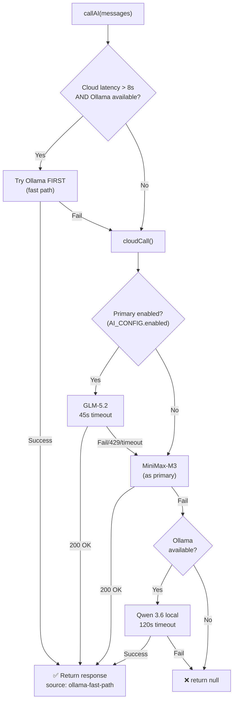

# 🔍 ECO Command Center — Full Codebase Audit

> Audit date: 2026-07-15 | Codebase: `d:\eco` | Server: 3503 lines | Frontend: ~6000 lines across 24 JS files

---

## Part 1: Complete Feature Catalog

| # | Feature | Status | Files |
|---|---------|--------|-------|
| 1 | **Trending Products** — live scraping (Amazon, Flipkart, Google) + AI ranking | ✅ Working | `trending.js`, `server.js` |
| 2 | **Product Search** — query + URL reverse-lookup + image upload | ✅ Working | `search.js`, `server.js` |
| 3 | **Saved List** — persistent SQLite, pin/unpin, delete, staleness tracking | ✅ Working (fixed this session) | `saved.js`, `db.js` |
| 4 | **Saved Detail Modal** — 6-tab modal (Overview, Financials, Ops, Marketing, Supplier, Export) | ⚠️ Partial — CSS incomplete | `saved-detail-modal.js` |
| 5 | **Dashboard** — stats cards, market snapshot, inventory forecast | ✅ Working | `dashboard.js` |
| 6 | **Calculator** — profit/cost/margin calculator | ✅ Working | `calculator.js` |
| 7 | **Supplier Discovery** — auto-discover, contact, feedback | ✅ Working | `suppliers.js`, `supplier-tab-ui.js` |
| 8 | **AI Chatbot Agent** — multi-turn chat with tool-calling (search, scrape, compare) | ✅ Working | `chatbot.js` |
| 9 | **AI Business Coach** — contextual tips per page | ✅ Working | `ai-coach.js` |
| 10 | **Competitor Tracker** — price monitoring, alerts | ✅ Working | `competitor-tracker.js` |
| 11 | **Financial Engine** — EBITDA, ROI, break-even analysis | ✅ Working | `financial-engine.js` |
| 12 | **Tax Engine** — GST/HSN for India, VAT for EU, Sales Tax for US | ✅ Working | `tax-engine.js` |
| 13 | **Export Engine** — CSV, JSON, PDF export of saved items | ✅ Working | `export-engine.js` |
| 14 | **Currency Converter** — 150+ currencies with live rates | ✅ Working | `currency.js` |
| 15 | **Deep Research** — multi-round AI-guided scraping with gap analysis | ✅ Working | `server.js:handleDeepResearch` |
| 16 | **Research Worker** — background discovery every 3 min, auto-populates trending pool | ⚠️ Partially broken — AI failures crash cycle | `server.js:startResearchWorkerLoop` |
| 17 | **Discovery Stream** — SSE real-time product discovery with session management | ⚠️ Depends on worker | `discovery-stream-engine.js` |
| 18 | **Ollama Integration** — 3-tier fallback (GLM → MiniMax → local Qwen 3.6) | ⚠️ Incomplete — not all AI calls use it | `server.js` |
| 19 | **Server Control** — restart/stop/start from UI | ✅ Fixed this session | `app.js`, `server.js` |
| 20 | **PWA** — service worker, install prompt, offline cache | ✅ Working | `app.js`, `service-worker.js` |
| 21 | **Settings** — API key management, Ollama status panel | ✅ Working | `app.js`, `index.html` |
| 22 | **Listing Generator** — AI-generated marketplace listings (Amazon, Flipkart, etc.) | ✅ Working | `server.js:callAIForListing` |
| 23 | **Supplier Communicator** — AI-drafted inquiry emails/WhatsApp | ⚠️ Qwen integration incomplete | `supplier-communicator.js` |

---

## Part 2: All Bugs Found

### 🔴 Critical Bugs

| # | Bug | File | Lines | Impact |
|---|-----|------|-------|--------|
| **C1** | **AI connectivity never recovers** — `checkConnectivity()` runs only at boot + on browser online/offline events. NO periodic heartbeat. If cloud AI drops mid-session, badge stays green forever. | `app.js` | 402, 372 | User thinks AI is online when it's dead |
| **C2** | **7+ functions bypass `callAI()` fallback chain** — `handleProductDetail`, `handleAgentChat`, `callAIForListing`, `extractProductFromPage`, `fetchAIProductData`, `testAPIKey` all make **direct HTTPS requests** to NVIDIA API. They get NO MiniMax fallback, NO Ollama fallback. | `server.js` | 759, 896, 1204, 1781, 1882, 2322, 2725 | When GLM is down, these features silently fail |
| **C3** | **`preOptimizePrompt()` is dead code** — defined but NEVER called. Was supposed to use Qwen to optimize prompts before sending to cloud AI. | `server.js` | 200-207 | Qwen prompt optimization never activates |
| **C4** | **`hero-research-orchestrator.js` has NO Ollama fallback** — if `aiClient.queryWithSystem()` fails, the entire research cycle crashes. The planner phase has zero fallback. | `hero-research-orchestrator.js` | 77-89 | Background research worker keeps crashing silently |
| **C5** | **Saved detail modal CSS is largely missing** — modal uses ~40 CSS classes (`.tab-grid-2`, `.tab-grid-3`, `.info-card`, `.info-row`, `.badge.good`, `.badge.bad`, `.comm-tabs`, `.export-grid`, `.export-card`, etc.) that don't exist in `styles.css` | `styles.css` | N/A | Modal tabs render as unstyled raw HTML |

### 🟡 Medium Bugs

| # | Bug | File | Lines | Impact |
|---|-----|------|-------|--------|
| **M1** | **Bizarre Authorization header chain** — 7 places use `typeof cfg !== 'undefined' && cfg.apiKey ? ... : typeof key !== 'undefined' ? ...` — references variables not in scope in some contexts | `server.js` | 759, 896, 1204+ | Potential auth failures on edge cases |
| **M2** | **`/api/ollama/status` mode doesn't show `ollama-only`** — when no cloud keys are configured but Ollama is available, mode shows `cloud-primary-ollama-fallback` instead of `ollama-only` | `server.js` | 500-501 | Misleading status display |
| **M3** | **`refreshSavedProductDetail()` fetches ALL saved items** to find one by ID — calls `getSaved()` then `.find()` instead of `getSavedById(id)` | `db.js` | 291 | Wasteful — O(n) instead of O(1) |
| **M4** | **Search has no error catch** — `runSearchPage()` has no visible catch block. If fetch fails, UI stays in loading state permanently | `search.js` | 196+ | Stuck spinner on search failure |
| **M5** | **Dexie CDN still loaded** — `<script src="unpkg.com/dexie@4">` in `index.html` is only used for one-time migration. Wastes bandwidth. | `index.html` | 736 | 100KB wasted download |
| **M6** | **Dashboard re-checks AI connectivity** on every render — calls `AIEngine.checkConnection()` redundantly | `dashboard.js` | 48 | Adds latency on each dashboard load |

### 🟢 Already Fixed This Session

| # | Bug | Fix |
|---|-----|-----|
| F1 | `GET /api/db/saved/:id` route missing — modal never opened | Added `handleDBGetSavedById` route |
| F2 | Refresh button opened modal instead of refreshing | Added `refresh-saved` and `pin-saved` to open-detail exclusion list |
| F3 | Delete/Pin used old `db.saved.get()` Dexie API | Replaced with `getSavedById()` / `updateSaved()` |
| F4 | Auto-refresh caused infinite flicker loop | Added `_autoRefreshInProgress` guard + `skipAutoRefresh` param |
| F5 | Broken template literal on platform tag | Fixed mismatched quotes |
| F6 | Server restart spawned orphan process on Windows | Changed to in-process soft restart |

---

## Part 3: AI Architecture Analysis

### Current Fallback Chain in `callAI()`



### Functions that BYPASS this chain (Critical Gap)

| Function | Line | What it does | Gets Ollama? |
|----------|------|-------------|-------------|
| `handleProductDetail` | 759 | Fetches detailed product data from AI | ❌ NO |
| `handleAgentChat` | 896 | Chatbot AI responses | ❌ NO |
| `callAIForListing` | 2288 | Marketplace listing generation | ❌ NO |
| `extractProductFromPage` | 1204 | URL reverse-lookup AI analysis | ❌ NO |
| `fetchAIProductData` | 1781 | Deep product research | ❌ NO |
| `testAPIKey` | 1882 | Key validation | ❌ NO (acceptable) |
| `callAIWithConfig` | 3154 | Agent tool-call AI | ❌ NO |

> [!CAUTION]
> **This is why AI "goes offline and never comes back"** — most user-facing features bypass `callAI()` and make raw HTTPS calls. When GLM returns 429, these functions fail silently with no fallback to MiniMax or Ollama.

### Ollama Availability Check

```
Startup → checkOllamaAvailability() → sets _ollamaAvailable
Every 5 min → checkOllamaAvailability() → updates _ollamaAvailable
```

- ✅ Ollama check is periodic (5 min interval)
- ❌ But `callOllama()` sets `_ollamaAvailable = false` on ANY error (line 172) — so one timeout permanently marks Ollama as dead until the next 5-min check

---

## Part 4: Improvement Plan

### Priority 1: Make ALL AI Calls Use `callAI()` with Ollama Fallback

**Goal:** Every function that currently makes a direct HTTPS call to NVIDIA should be refactored to use `callAI()`, which already has the 3-tier fallback chain.

**Files to change:** `server.js` — 7 functions

### Priority 2: AI Connectivity Auto-Recovery

**Goal:** Add a 60-second heartbeat that re-checks AI status and updates the badge. When AI recovers, automatically show a toast and re-enable features.

**Files to change:** `app.js` — add `setInterval(checkConnectivity, 60000)` after initial check

### Priority 3: Smart Qwen Prompts

**Goal:** Since Qwen 3.6 is a smaller model, it needs carefully crafted prompts to produce structured JSON. Create a prompt library with:
- Role definitions ("You are an e-commerce product analyst...")
- Output format specifications (exact JSON schema)
- Few-shot examples for each use case
- Token-efficient instructions

**New file:** `src/qwen-prompts.js` — exported prompt templates for:
- Trending product analysis
- Search result enrichment
- Product detail research
- Listing generation
- Supplier communication
- Market gap analysis

### Priority 4: Activate `preOptimizePrompt()`

**Goal:** Wire up the existing dead code so Qwen preprocesses prompts before sending to cloud AI, improving response quality.

### Priority 5: Modal CSS Completion

**Goal:** Add all missing CSS classes for the 6-tab saved detail modal.

**Classes to add (~40):** `.tab-grid-2`, `.tab-grid-3`, `.info-card`, `.info-row`, `.badge`, `.badge.good`, `.badge.bad`, `.badge.warn`, `.comm-tabs`, `.comm-tab`, `.export-grid`, `.export-card`, `.export-platform`, `.export-status`, `.btn-export`, `.btn-ai`, `.ad-copy-tabs`, `.ad-tab`, `.missing`, and more.

### Priority 6: Fix `refreshSavedProductDetail()`

**Goal:** Use `getSavedById(id)` instead of fetching all items. Also make it use `callAI()` via the server endpoint.

---

## Part 5: File Statistics

| File | Lines | Role |
|------|-------|------|
| `server.js` | 3503 | Backend: AI proxy, scraping, DB, all API endpoints |
| `db/sqlite.js` | 1036 | SQLite schema, CRUD, temp tables |
| `src/discovery-stream-engine.js` | 676 | Product discovery orchestrator with 3-tier AI |
| `src/hero-research-orchestrator.js` | 384 | Research planner/critic cycle |
| `js/trending.js` | 1527 | Trending page rendering + deep research UI |
| `js/search.js` | 737 | Search page with AI/normal modes |
| `js/saved-detail-modal.js` | ~500 | 6-tab product detail modal |
| `js/saved.js` | 379 | Saved list rendering + event handlers |
| `js/db.js` | 550 | REST DB client (replaced Dexie) |
| `js/chatbot.js` | 357 | AI agent chat interface |
| `js/app.js` | 638 | Navigation, init, settings, server control |
| `js/dashboard.js` | 359 | Dashboard stats + market snapshot |
| `js/ai-engine.js` | 459 | Frontend AI proxy client |
| `js/financial-engine.js` | ~300 | EBITDA/ROI calculations |
| `js/calculator.js` | ~250 | Profit calculator UI |
| `css/styles.css` | 3301 | All application styles |
| **Total** | **~15,000** | |
